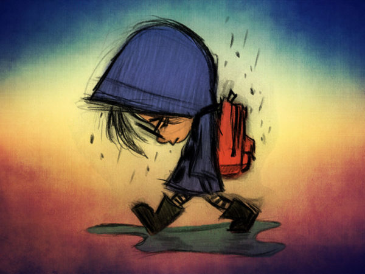

layout: true
```{r setup, include=FALSE}
options(htmltools.dir.version = FALSE)

knitr::opts_chunk$set(
	echo = FALSE,
	fig.align = "center",
	message = FALSE,
	warning = FALSE,
	cache = FALSE
)
```

---
class: middle, center

# Sabemos que foi um ano difícil para todos nós...


```{r, out.width="70%"}

```
---
class: middle, center

# Um ano que provalmente sempre vamos lembrar...

```{r, out.width="70%"}

```
---
class: middle, center

# Ou tentar esquecer...

```{r, out.width="70%"}

```
---
class: middle, center

# Mas foi também um ano de muito estudo... 

```{r, out.width="50%"}
knitr::include_graphics("https://media.giphy.com/media/1iu8uG2cjYFZS6wTxv/giphy.gif")
```
---
class: middle, center

# Tanto que vocês escolheram fazer uma disciplina complicada...  

```{r, out.width="60%"}
knitr::include_graphics("https://media.giphy.com/media/l2JeblbdfRL0i2qOI/giphy.gif")
```

---
class: middle, center

# Sobre um tema difícil...  

```{r, out.width="60%"}
knitr::include_graphics("https://media.giphy.com/media/Xf6xaPpxYbDliLCbvz/giphy.gif")
```
---
class: middle, center

# Queremos agradecer a participação, o empenho, a seriedade e a integridade científica de tod@s vocês!  

```{r, out.width="60%"}
knitr::include_graphics("https://media.giphy.com/media/ZThQqlxY5BXMc/giphy.gif")
```
---
class: middle, center

# Estamos orgulhosos que a Universidade Federal da Bahia tenha estudantes extremamente competentes e compromissados com a pesquisa sobre a sociedade!  

```{r, out.width="60%"}
knitr::include_graphics("https://media.giphy.com/media/5yLgockmAasiAWq5NsY/giphy.gif")
```
---
class: middle, center

# Os Profs. Leonardo e Paulo gostariam de desejar um feliz natal e excelente ano novo!  

```{r, out.width="70%"}
knitr::include_graphics("https://media.giphy.com/media/RdzzVrtvfqnM4/giphy.gif")
```
---
class: middle, center

# Descansem bem nesta virada do ano...

```{r, out.width="70%"}
knitr::include_graphics("https://media.giphy.com/media/M6VwB7tIUdZYI/giphy.gif")
```
---
class: middle, center

# Pois em 22/02/2021, estaremos esperando os artigos para publicação!

```{r, out.width="70%"}
knitr::include_graphics("https://media.giphy.com/media/jeBHdGZSqIRVxyN7p5/giphy.gif")
```

---
class: middle, center

## Obrigado gente!

.pull-left[
```{r, out.width="100%"}
knitr::include_graphics("https://media.giphy.com/media/KzKHlzSlfHZV44EdTy/giphy.gif")
```
]
.pull-right[
##**Agradecimentos especiais**:
### Eu quero agradecer ao Prof. Paulo Fonseca pela parceria na disciplina, primeira de muitas!
<br>
### Qualquer dúvida podem chamar no Telegram!
<br>
### Codifiquem e escrevam!!!!
]

